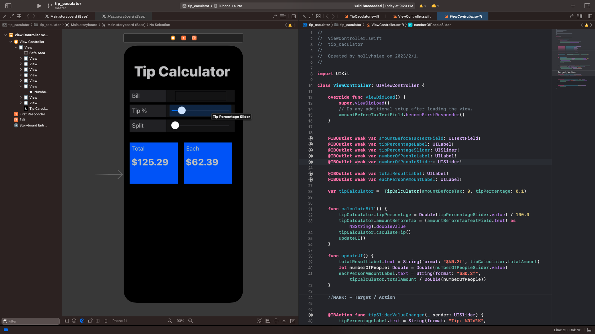
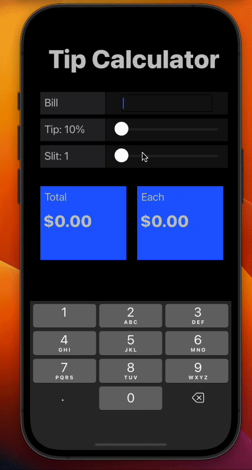
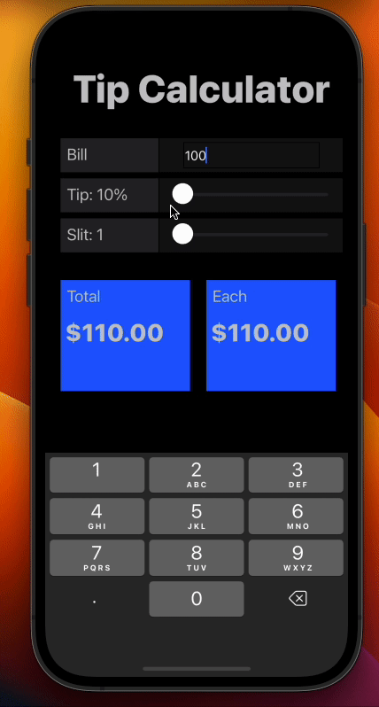
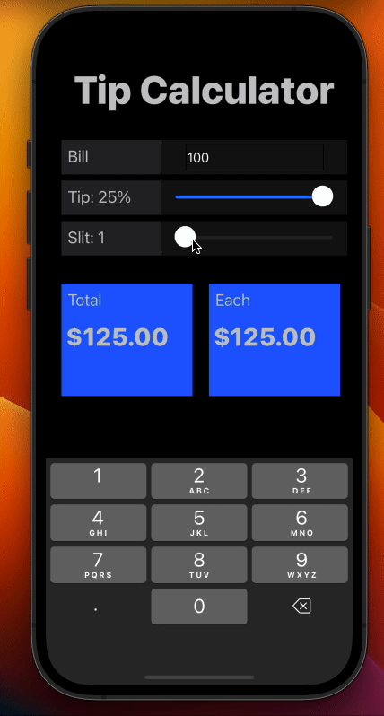

# Tip Calculator
看完了 ios 課程的興趣初探後，覺得意猶未盡。想快點動手動手實際做些什麼，於是找了 Tip Calculator 進行練習。一方面是想趕快熟悉 Xcode 的操作介面，另一方面是透過這個小練習能稍微了解 storyboard 運作的方式。  
感想是 Xcode 真不愧是 Apple 自家的 IDE，連開發都非常直觀。像這樣用拖曳物件配上連接 code 的方式完成一個簡單的使用者介面，真的讓新手超有成就感的！

# Demo
正如其名，Tip Calculator 就是協助使用者計算小費的小工具。除此之外，也提供了分賬的功能。   
使用者可以使用數字鍵盤在 Bill 裡輸入本次帳單的金額。左邊的藍色方框會呈現加總完小費的總帳單金額、右邊則會顯示分帳後每人須負擔金額。  
  
可以在 Tips 的 Slider 調整小費百分比。  
  
可於 Slit Slider 調整分攤帳單人數。  

# Reference
Tutorial Video: [David Tran](https://www.youtube.com/watch?v=eT1Z3s9WCR4)